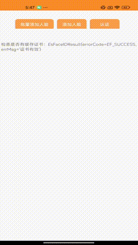

网关接入参考SDK
---
## 概述

APP (ANDROID, IOS), PC (WINDOWS, LINUX）新创系统 (统信，麒麟)  离线人脸识别 （包括离线活体检测）

#### 演示DEMO - Android




文档可参考：https://esandinfo.yuque.com/yv6e1k/aa4qsg/lgpdfmt4k9bk62wv


## 联系我
有任何问题或疑问可联系我
```
瑞德

微信：esand_info
qq: 3626921591
电话：13691664797
邮箱：reid.li@foxmail.com
```

扫码加我微信


